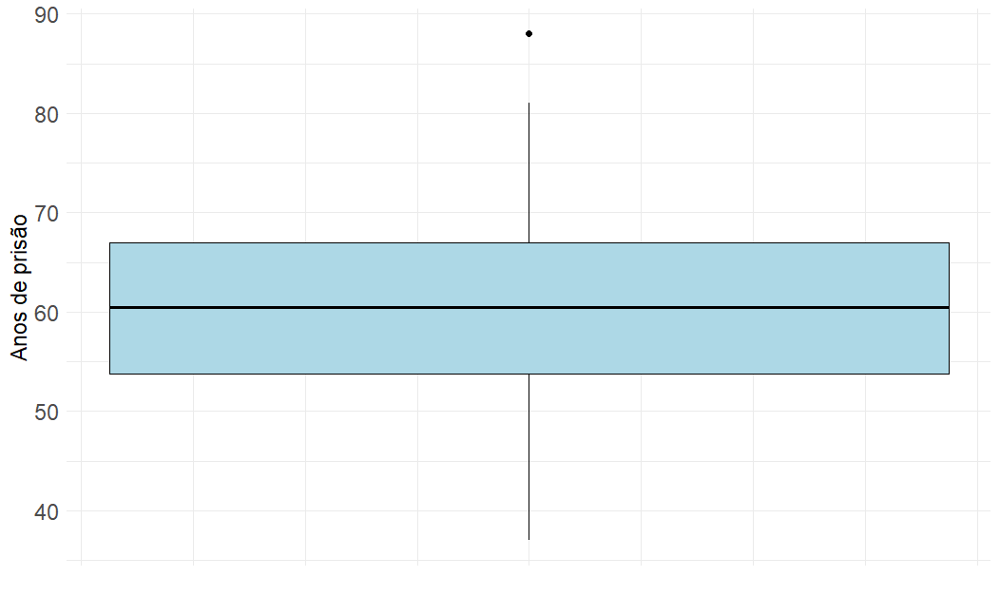
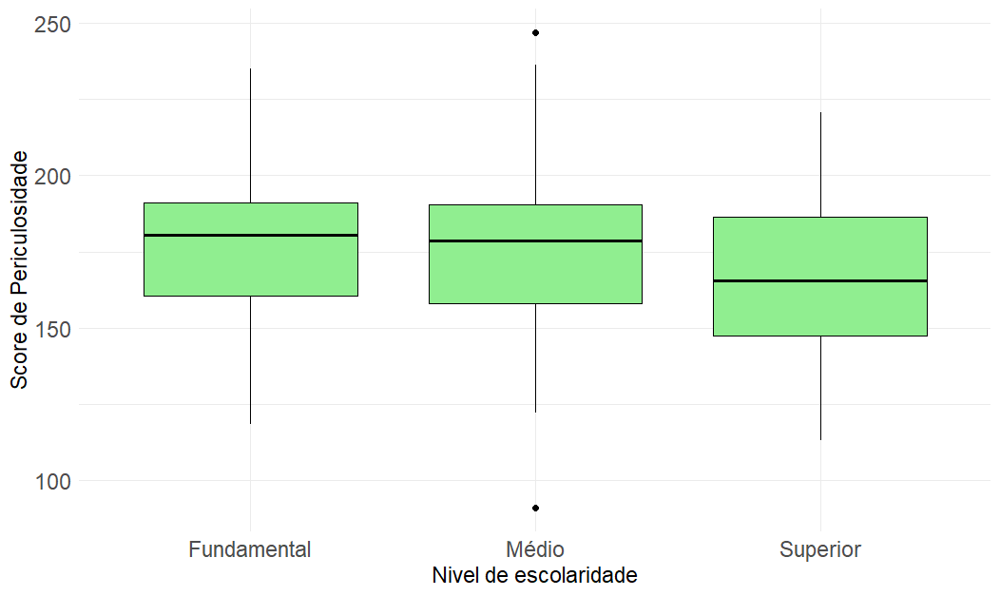
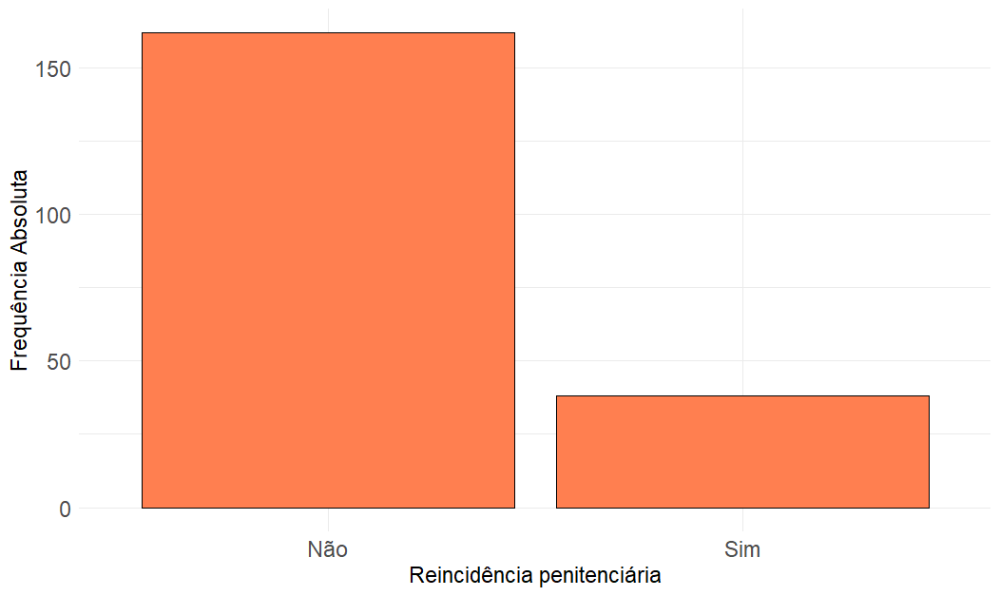
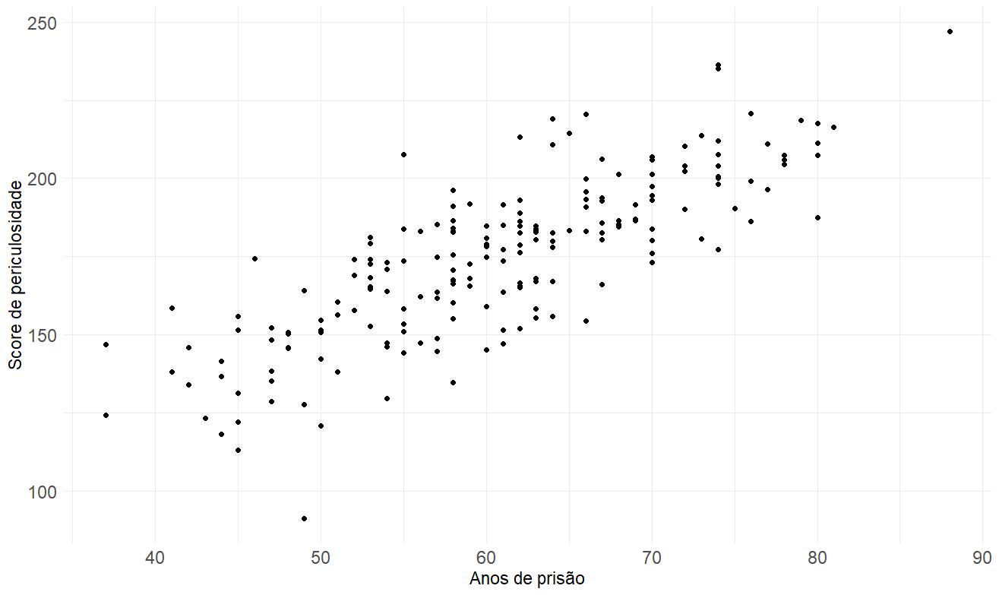

# Análise Exploratória
Repositório destinado ao upload das atividades da disciplina "Prática 
Estatística 2", ministrada no curso de graduação em estatística da UFF, 
pela professora Ludmilla Viana.

# Contextualização
A análise baseia-se em dados de uma penitênciária fictícia.

# Metodologia
Para fins de análise iremos utilizar as seguintes medidas de centralidade e 
dispersão:

Média amostral: $\bar{x} = \frac{\sum_{i = 1}^n x_i}{n}$

Quantil de ordem p: $q_p$ é um valor pertencente à amostra tal que pelo 
menos $100 p \%$ dela é menor ou igual a ele. Observação: $Q_1$, $Q_2$ e $Q_3$ 
são, respectivamente os quantis de ordem 0.25, 0.5 e 0.75.

Variância amostral: $S^2 = \frac{\sum_{i = 1}^n (x_i - \bar{x})^2}{n-1}$

Desvio-padrão amostral: $S = \sqrt{S^2}$

Amplitude: $\hat{R} = x_{(n)} - x_{(1)}$ onde $x_{(i)}$ é a i-ésima
menor observação do conjunto de dados.

# Resultados

## Idade
A seguir, o histograma das idades:

Nota-se uma leve simetria na distribuição, o que nos faz pensar que a média
das idades esteja entre 50 e 60 anos.

## Anos de prisão
A seguir, o boxplot dos anos de prisão

Nota-se que a mediana está centralizada no centro do intervalo interquartílico,
o que nos leva a concluir que a distribuição dos anos de prisão é simétrica.
O único ponto discrepante deve-se refererir à alguém que esteja em prisão 
perpétua.

## Score de periculosidade
A seguir, o boxplot do score de periculosidade por escolaridade

Nota-se que os 3 boxplots são parecidos, o que nos leva a pensar que não existe
associação entre essas duas variáveis.

## Contagem de criminosos reincidentes
A seguir, o gráfico de barras que informa a quantidade de criminosos na
penitênciária que foram presos novamente:

## Resumos descritivos
A seguir, resumos descritivos das variáveis idade, tempo de prisão e score de
periculosidade.

| Estatística | Idade | Tempo de prisão | Score de periculosidade |
|:---:|:---:|:---:|:---:|
| **Média** | 50,91 | 60,59 | 174,52 |
| **Q1 (25%)** | 34 | 53,75 | 155,70 |
| **Q2 (Mediana)** | 52 | 60,50 | 177,21 |
| **Q3 (75%)** | 64,25 | 67 | 191,12 |
| **Variância** | 374.0782 | 99.08822 | 660.5837 |
| **Desvio Padrão** | 19,3411 | 9.954306 | 25.70182 |
| **Amplitude** | 79 | 51 | 156.02 |

## Tempo de prisão e Score de periculosidade
A seguir, o gráfico de dispersão entre e o tempo de prisão e o Score de
periculosidade

Claramente há indícios de associação linear positiva entre estas variáveis.
O coeficiente de correlação estimado foi 0,8.

